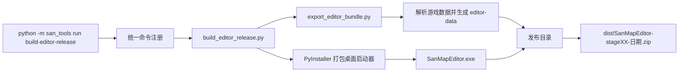

# 地图编辑器 Windows 打包链路

本文档列出当前 `build-editor-release` 从源码、游戏数据到 Windows 发布 ZIP 涉及的仓库文件、生成文件和职责。这里的“全部文件”指当前仓库内被发布入口直接或递归使用的项目文件，不包含 Python 标准库、Pillow、openpyxl、PyInstaller 自身的安装目录。

## 一、链路总览



构建命令：

```powershell
python -m pip install -e ".[release]"
python -m san_tools run build-editor-release . --stage stage01
```

## 二、入口和发布控制文件

| 文件 | 注释 |
| --- | --- |
| `pyproject.toml` | 声明 Python 版本、Pillow/openpyxl 依赖、`release` 组的 PyInstaller、`san-tools` 命令入口和 HTML/KSY package data。 |
| `src/san_tools/__main__.py` | 解析 `list/run`，把 `build-editor-release` 后面的参数原样转交目标模块。 |
| `src/san_tools/cli/command_registry.py` | 把命令名 `build-editor-release` 注册到 `san_tools.map.build_editor_release`；命令未注册时统一入口不会执行。 |
| `src/san_tools/project_paths.py` | 按环境变量和 `data/game`、`data/text` 查找构建输入，避免源码硬编码本机绝对路径。 |
| `src/san_tools/map/build_editor_release.py` | 发布总控：检查工作目录安全、重建 bundle、写发布元数据、调用 PyInstaller、组装目录、加入使用指南并生成最终 ZIP 和 JSON 清单。 |
| `src/san_tools/map/editor_desktop_launcher.py` | 被 PyInstaller 打成 `SanMapEditor.exe`；在 `127.0.0.1` 随机端口提供静态文件，打开浏览器并显示停止/重开按钮。 |
| `src/san_tools/map/export_editor_bundle.py` | bundle 总控：解析关卡、渲染地图和资源图集、建立场景/母表模型、复制参考文件、写 `stage.json`、编辑页和索引。 |
| `src/san_tools/map/editor_app.html` | 浏览器编辑器完整模板；导出时替换打包日期，生成每个关卡的 `editor.html`。地图编辑、管理 UI、撤销重做、导入导出和 ZIP 写入逻辑均在此文件。 |

## 三、地图资源和小地图依赖

| 文件 | 注释 |
| --- | --- |
| `src/san_tools/map/extract_kingdom.py` | 查找游戏目录、读取调色板并解析 `kingdom.cel` 中的 `acwx/acwy/acwz` 资源块。 |
| `src/san_tools/map/render_m_cel_map.py` | 把 `stageXX.m` 与 `kingdom.cel` 组合成等距 `map.png`，同时写渲染诊断 `map.json`。 |
| `src/san_tools/map/palette.py` | 提供 `SAN_RGB_PALETTE` 和数据标记颜色，是地图、小地图、资源缩略图和头像图集的颜色来源。 |
| `src/san_tools/map/minimap_sidecar.py` | 定义 `.s/.x` 的 160×160 网格和顶部 128 行有效区，校验参考文件并提取导出时保留的尾区。 |

## 四、场景、据点和城门依赖

| 文件 | 注释 |
| --- | --- |
| `src/san_tools/map/editor_model.py` | `.m/.dor/.stg` 字段级顺序模型；bundle 用 `StgFile` 读取势力、据点和 Entity。 |
| `src/san_tools/map/stg_editor_patch.py` | 为 `.stg` 建立字段偏移和对象布局，供浏览器安全修改和重建。 |
| `src/san_tools/analysis/analyze_dor.py` | 解析 `.dor` 分组和城门记录，提供城门坐标。 |
| `src/san_tools/analysis/stage_site_links.py` | 汇总 `.dor/.stg`，建立据点与城门归属；完整分析失败时 exporter 会退回直接坐标关联。 |
| `src/san_tools/analysis/analyze_stage_sidecars.py` | 为完整据点分析和 `stage.ini` 解析提供游戏目录及 sidecar 基础分析。 |
| `src/san_tools/analysis/analyze_stg_family_alignment.py` | 为 `stage.ini` 兼容视图和 STG 家族对齐提供统计结构。 |
| `src/san_tools/pipelines/export_stg_raw_chain.py` | 生成 `.stg` 原始记录链，供据点关系分析使用。 |
| `src/san_tools/pipelines/export_stg_hierarchy.py` | 生成势力、据点和实体层级。 |
| `src/san_tools/pipelines/export_stg_city_troop_analysis.py` | 生成据点状态、武将和士兵关联行。 |
| `src/san_tools/pipelines/export_stg_phase7_links.py` | 提供旧阶段字段候选对照，是当前完整关系分析的递归依赖。 |
| `src/san_tools/pipelines/export_stage_sidecar_tables.py` | 汇总 sidecar 表，是若干 STG 分析模块的共享依赖。 |

## 五、stage.ini、工作簿和文本依赖

| 文件 | 注释 |
| --- | --- |
| `src/san_tools/codecs/__init__.py` | codecs 包入口。 |
| `src/san_tools/codecs/stage_ini_codec.py` | 解析 `stage.ini` 主块、城池区和兼容表，提供字段和物理边界。 |
| `src/san_tools/codecs/stage_ini_txt_linkage.py` | 把 `stage.ini` 与 `data/text` 的 general/castle/History 等表建立字段级对应和新增行布局。 |
| `src/san_tools/codecs/stage_ini_excel_codec.py` | 使用 openpyxl 写 `stage_ini.xlsx`，同时负责非法 XML 字符清理和稳定样式。 |

## 六、格式规范文件

这些文件是模型事实来源，当前 exporter 不在构建时动态编译 KSY，但模型、测试和维护必须与其一致。

| 文件 | 注释 |
| --- | --- |
| `src/san_tools/ksy/m.ksy` | `.m` 头、Cell 字段、类型和顺序。 |
| `src/san_tools/ksy/dor.ksy` | `.dor` 分组、记录长度和城门字段。 |
| `src/san_tools/ksy/stg.ksy` | `.stg` 的 root、Force、Site、Entity 块流顺序。 |

## 七、构建输入文件

默认从 `data/game` 和 `data/text` 读取，也可用 `SAN_GAME_DATA_DIR`、`SAN_GAME_TEXT_DIR` 覆盖。

| 输入 | 是否关键 | 注释 |
| --- | --- | --- |
| `data/game/stageXX.m` | 必需 | 决定地图尺寸和全部 Cell。缺少时立即停止。 |
| `data/game/kingdom.cel` | 必需 | 提供三层地图资源。 |
| `data/game/kingdom.atr` | 资源相关 | 提供资源属性；部分渲染和分析路径使用。 |
| `data/game/stageXX.dor` | 推荐 | 提供城门和据点坐标关系；缺少时管理和导出能力下降。 |
| `data/game/stageXX.stg` | 推荐 | 提供势力、据点、武将和士兵。 |
| `data/game/stageXX.s/.x` | 推荐 | 提供小地图 sidecar 尾区；缺少时导出用 0 填充尾区并产生警告。 |
| `data/game/stage.ini` | 推荐 | 提供城池和武将母表，是新增对象安全写回的基础。 |
| `data/game/heads.dat` | 推荐 | 复制进 bundle，并生成 `heads.png` 头像图集。 |
| `data/game/History.txt` | 推荐 | 提供历史记录和未加入剧本武将。 |
| `data/text/*.txt` | 推荐 | 提供 UTF-8 字段名称、武将/城池/兵种等关联表。 |

## 八、bundle 生成文件

工作目录默认为 `derived/editor-release/bundle`。这些都是可再生文件，不提交 Git。

| 生成文件 | 注释 |
| --- | --- |
| `index.html` | 多关卡入口页；发布包默认直接打开指定关卡，入口页作为回退。 |
| `index.json` | 关卡清单，记录关卡名、编辑页路径和地图尺寸。 |
| `release-info.json` | 创建者、打包日期、精确打包时间和默认关卡；启动器显示该信息。 |
| `stageXX/editor.html` | 从 `editor_app.html` 复制并替换打包日期后的实际编辑器。 |
| `stageXX/stage.json` | 编辑器主数据：Cell、字段元数据、调色板、资源引用、场景模型、母表模型和 sidecar 尾区。 |
| `stageXX/map.png` | 打包时生成的完整地图底图。大图超限时浏览器会改用资源图集重建视口。 |
| `stageXX/map.json` | 地图渲染器生成的尺寸、原点、资源和渲染统计诊断。 |
| `stageXX/minimap.png` | 从 `map.png` 缩放的初始小地图；编辑后由 Cell 的 `minimap_color` 重建。 |
| `stageXX/resources.json` | 三层资源目录、编号、使用次数、图集矩形和绘制锚点。 |
| `stageXX/resources_acwx.png` | 底层资源库缩略图图集。 |
| `stageXX/resources_acwy.png` | 叠加资源库缩略图图集。 |
| `stageXX/resources_acwz.png` | 物件资源库缩略图图集。 |
| `stageXX/draw_acwx.png` | 主画布重建底层时使用的原尺寸资源图集。 |
| `stageXX/draw_acwy.png` | 主画布重建叠加层时使用的原尺寸资源图集。 |
| `stageXX/draw_acwz.png` | 主画布重建物件层时使用的原尺寸资源图集。 |
| `stageXX/heads.png` | 按 `heads.dat` 和 SAN 调色板生成的头像图集。 |
| `stageXX/heads.dat` | 原始头像参考，浏览器导出时原样带出。 |
| `stageXX/History.txt` | 原始历史表参考，浏览器编辑后重建。 |
| `stageXX/stage.ini` | 原始全局母表参考，浏览器按字段修改和追加。 |
| `stageXX/stage_ini.xlsx` | `stage.ini` 字段工作簿，供检查和导出。 |
| `stageXX/stageXX.dor` | 原始城门参考，浏览器保持未知字节并重建已编辑记录。 |
| `stageXX/stageXX.stg` | 原始剧本参考，浏览器按已确认布局修改或重建。 |

缺少可选输入时，对应生成文件可能不存在；原因会写入 `stage.json` 并显示在“校验”。

## 九、PyInstaller 中间文件

工作目录默认为 `derived/editor-release`。这些文件只用于构建和排错，不放进最终用户目录。

| 文件 | 注释 |
| --- | --- |
| `SanMapEditor.spec` | PyInstaller 根据命令自动生成的规格文件；当前链路每次重建，不应手工维护。 |
| `pyinstaller/SanMapEditor/Analysis-00.toc` | 依赖分析清单。 |
| `pyinstaller/SanMapEditor/PYZ-00.pyz` | Python 模块归档。 |
| `pyinstaller/SanMapEditor/PYZ-00.toc` | PYZ 内容索引。 |
| `pyinstaller/SanMapEditor/PKG-00.toc` | onefile 包内容索引。 |
| `pyinstaller/SanMapEditor/EXE-00.toc` | 最终 EXE 组装索引。 |
| `pyinstaller/SanMapEditor/SanMapEditor.pkg` | onefile 内部数据包。 |
| `pyinstaller/SanMapEditor/base_library.zip` | Python 基础库归档。 |
| `pyinstaller/SanMapEditor/warn-SanMapEditor.txt` | 未找到模块等警告；发布失败或启动异常时优先检查。 |
| `pyinstaller/SanMapEditor/xref-SanMapEditor.html` | 可视化依赖交叉引用。 |
| `pyinstaller/SanMapEditor/localpycs/*.pyc` | PyInstaller 启动相关缓存字节码。 |
| `derived/editor-release/dist/SanMapEditor.exe` | PyInstaller 的直接输出，随后复制进发布目录。 |

## 十、最终发布目录和 dist 文件

发布目录：

```text
derived/editor-release/SanMapEditor-stageXX/
├── SanMapEditor.exe
├── 使用说明.txt
├── 编辑器使用指南.md
└── editor-data/
    ├── index.html
    ├── index.json
    ├── release-info.json
    └── stageXX/
        └── 上一节列出的全部关卡 bundle 文件
```

| 文件 | 注释 |
| --- | --- |
| `SanMapEditor.exe` | 单文件桌面启动器，不包含大型地图资源；必须与 `editor-data` 同级。 |
| `使用说明.txt` | 最短启动说明、创建者、打包时间和完整指南入口。使用 UTF-8 BOM，方便 Windows 记事本打开。 |
| `编辑器使用指南.md` | 从 `docs/EDITOR_USER_GUIDE.zh.md` 复制的完整用户手册。 |
| `editor-data/` | 浏览器编辑器和全部关卡静态资源。 |
| `dist/SanMapEditor-stageXX-日期.zip` | 交给编辑人员的最终压缩包。 |
| `dist/SanMapEditor-stageXX.json` | 构建结果清单，记录归档路径、大小、创建者、时间和 bundle 摘要。 |

## 十一、发布链路测试文件

| 文件 | 注释 |
| --- | --- |
| `tests/test_editor_desktop_launcher.py` | 检查数据目录发现、本机监听、工作目录安全和发布指南复制。 |
| `tests/test_editor_build_metadata.py` | 检查打包日期替换和 HTML/KSY package data。 |
| `tests/test_editor_app_v2.py` | 检查编辑器模板入口、字段模型、场景模型和脚本语法。 |
| `tests/test_editor_app_runtime_behaviors.py` | 用 Node 隔离验证撤销重做、区域操作、导入、ZIP 和关键运行时状态。 |
| `tests/test_editor_app_new_site_export.py` | 检查新增城池的 `stage.ini/.stg` 写回链路。 |
| `tests/test_editor_documentation.py` | 检查用户指南、打包链路文档、文档索引和发布脚本是否保持关联。 |

## 十二、构建和交付检查

```powershell
python -m unittest discover -s tests -v
python -m san_tools run build-editor-release . --stage stage01
```

构建后检查：

1. `dist` 中 ZIP 和 JSON 清单均存在。
2. 解压 ZIP 后，EXE、`editor-data`、短说明和完整指南都存在。
3. 双击 EXE 能打开浏览器，启动器显示正确创建者和打包时间。
4. `editor-data/stageXX/stage.json` 能加载，地图和头像不是空白。
5. 打开“校验”，没有红色阻断错误。
6. 执行一次最小编辑并导出 `stageXX-export.zip`。
7. 检查 PyInstaller 的 `warn-SanMapEditor.txt`，确认没有影响启动器的缺失模块。
8. 发布 ZIP 含游戏素材和派生图集，只能在确认再分发权后公开上传。
