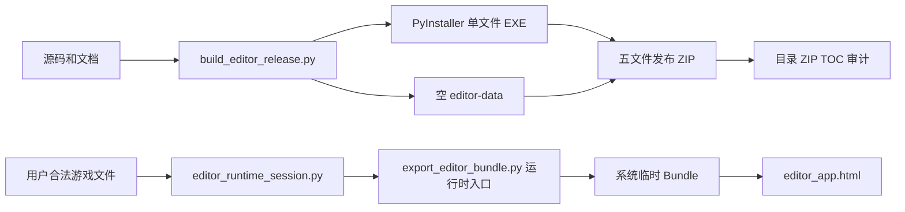

# 地图编辑器 Windows 无资源打包链路

本文描述正式代码发布与用户运行时资源生成两条隔离链路。正式 ZIP 不携带关卡、头像、文本或派生图片；这些内容只在用户导入后进入系统临时会话。

## 一、链路总览



构建不得读取 `data/game`、`data/text` 或本机游戏目录；运行时只读取启动器明确选择的同一目录。

## 二、正式构建

```powershell
python -m pip install -e ".[release]"
python -m san_tools run build-editor-release .
```

`build-editor-release` 不接受 `--stage`。默认工作目录为 `derived/editor-release`，输出目录为 `dist/`；`--work-dir` 必须位于项目根内，`--output-dir` 可修改归档目录。

### 构建源码职责

| 文件 | 职责 |
| --- | --- |
| `build_editor_release.py` | PyInstaller、空入口、五文件组包、Manifest 和审计总控。 |
| `editor_desktop_launcher.py` | 四态资源选择、本机 HTTP 服务和固定端口内容切换。 |
| `editor_runtime_session.py` | 输入校验、事务会话、复用、关闭清理和过期回收。 |
| `export_editor_bundle.py` | 运行时地图、图集、小地图、头像、场景模型与写回模型生成。 |
| `stage_ini_codec.py` | `stage.ini` 真实块流解析。 |
| `editor_app.html` | 浏览器编辑、校验和用户导出。 |
| `m.ksy`、`dor.ksy`、`stg.ksy` | 二进制字段顺序和类型规范。 |
| `EDITOR_USER_GUIDE.zh.md` | 复制为发布目录中的 `编辑器使用指南.md`。 |

PyInstaller 在工作目录生成 `SanMapEditor.spec`、Analysis/EXE/PKG/PYZ TOC、警告和交叉引用；这些是可再生中间文件，不进入最终 ZIP。

## 三、最终发布目录

目录与 ZIP 必须精确包含：

```text
SanMapEditor/
├── SanMapEditor.exe
├── editor-data/
│   ├── index.html
│   └── release-info.json
├── 使用说明.txt
└── 编辑器使用指南.md
```

`index.html` 是不发起资源请求的空项目页，`release-info.json` 声明 `user-import-only` 与 `system-temp`。不得包含 `index.json`、`stageXX/`、`stage.json`、图片图集或任何游戏扩展名。

构建还在 ZIP 外生成 `SanMapEditor-日期-manifest.json` 和 `SanMapEditor-release.json`，记录每个白名单文件、归档大小、SHA-256 和 TOC 路径。

## 四、运行时输入

除可选 `kingdom.atr` 外，下列文件必须位于同一显式目录：

| 输入 | 用途 |
| --- | --- |
| `stageXX.m` | 地图头、尺寸和 Cell。 |
| `stageXX.dor/.stg` | 城门、势力、据点、武将和士兵。 |
| `stageXX.s/.x` | 小地图有效区与用户原始尾区。 |
| `stage.ini`、`History.txt` | 城池、武将和历史母表。 |
| `kingdom.cel`、`heads.dat` | 地图资源和头像像素。 |

校验器记录路径、作用、大小和 SHA-256，拒绝缺失、大小写重复、场景编号错配、非法 `.m` 头和异常尺寸。选择目录时只能存在一个 `stageXX.m`。

## 五、临时会话 Bundle

`RuntimeSessionManager` 在 `%TEMP%/SanMapEditor/stageXX-UUID` 创建带专用标记的会话。`session-info.json` 记录输入报告和导出结果，`editor-data/stageXX` 中生成 `stage.json`、`resources.json`、`map.png`、`minimap.png`、`heads.png`、资源图集、参考文件和 `stage_ini.xlsx`。

新 Bundle 完整生成后才替换旧会话；失败删除半成品并保留旧会话。相同路径、大小和哈希复用当前会话。正常关闭清理当前会话；启动时只回收超过有效期且带标记的直接子目录。

运行时公共模型只使用用户 `stage.ini` 与 `History.txt`。`stage_ini_codec.py` 配合内置 49/17 字段生成写回位置；完整 CP950 映射由 Python 编解码器枚举验证，不读取 `data/text`。

## 六、用户导出边界

- `.dor/.stg/stage.ini/History.txt/heads.dat` 只复制到当前临时会话。
- 原始 `.s/.x` 不进入发布包；其合法尾区写入 `stage.json.sidecars`。
- 浏览器导出缺少或发现异常尾区时直接阻断，禁止零填充。
- 网页内重新导入 `.m` 需要替换确认，仅用于同一桌面资源会话续编。
- 用户下载的 `stageXX-export.zip` 可含游戏文件、工作簿和 Patch，它不是正式程序发布包。

## 七、资源审计

`editor_release_audit.py` 对目录和 ZIP 执行相同规则：

1. 精确命中五文件白名单。
2. 拒绝路径穿越、盘符路径、重复 ZIP 条目和关卡目录。
3. 拒绝游戏扩展名、原始文件名和派生图片名。
4. 目录与 ZIP 的路径、字节数和 SHA-256 逐项一致。
5. Analysis、EXE、PKG、PYZ TOC 不得引用游戏资源。

## 八、验证

```powershell
python -m unittest discover -s tests
python -m san_tools run build-editor-release .
.\derived\editor-release\SanMapEditor\SanMapEditor.exe --data-dir .\derived\editor-release\SanMapEditor\editor-data --check
```

关键测试包括 `test_editor_release_audit.py`、`test_editor_resource_free_build.py`、`test_editor_runtime_session.py`、`test_editor_runtime_bundle.py`、`test_editor_runtime_text_independence.py`、`test_editor_resource_free_ui.py` 和 `test_editor_documentation.py`。

## 九、发布门禁

1. 完整测试、真实样本、EXE `--check`、目录/ZIP/TOC 审计全部通过。
2. Manifest 与实际 ZIP 哈希一致，工作区没有暂存本地游戏数据。
3. 在合法游戏副本中人工验证地图、势力、据点、城门、武将、士兵和小地图。
4. 对 `SAN_RGB_PALETTE` 的公开发布权利边界完成法律确认。

自动资源审计不能替代第 3、4 项人工门禁。
